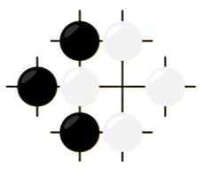
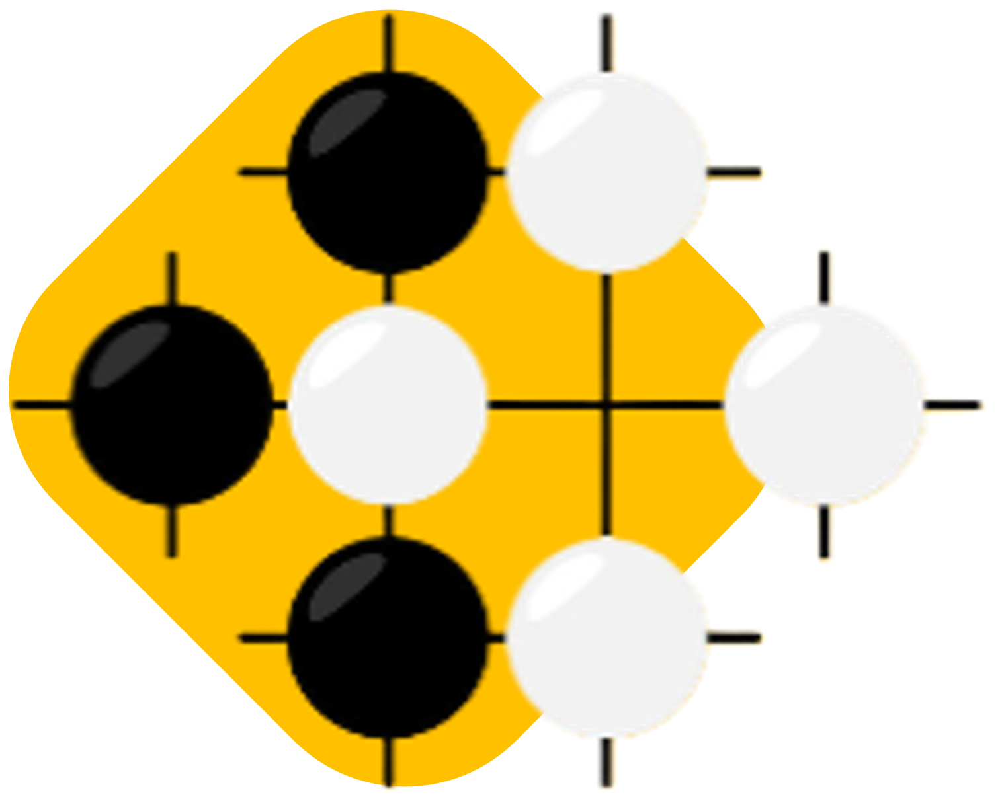

<!---->

<div align="center">
    
    <h1>GOGAME-DETECTION</h1>
</div>
<h3>◦ Developed with the software and tools below.</h3>
<p align="center">
  <a href="https://skillicons.dev">
    
  </a>
</p>

---

## 📖 Table of Contents
- [📖 Table of Contents](#-table-of-contents)
- [📍 Overview](#-overview)
- [📦 Features](#-features)
- [📂 repository Structure](#-repository-structure)
- [⚙️ Modules](#modules)
- [🚀 Getting Started](#-getting-started)
    - [🔧 Installation](#-installation)
    - [🤖 Running GoGame-Detection](#-running-GoGame-Detection)
- [🛣 Roadmap](#-roadmap)
- [👏 Acknowledgments](#-acknowledgments)

---


## 📍 Overview

GoGame-Detection is an innovative project designed to automate the detection and recognition of Go board game positions using computer vision and machine learning. The primary objective is to streamline the process of capturing and interpreting Go game states from images or video frames. This project combines advanced algorithms with a user-friendly interface to make Go game analysis and visualization accessible to a broader audience.

Key Highlights:
- **Automated Recognition:** Utilizes cutting-edge computer vision techniques to automatically recognize the positions of black and white stones on the Go board.
- **Real-time Processing:** Capable of processing live video feeds, allowing for real-time tracking of Go game progress.
- **Intuitive Visualization:** Generates visual representations of Go game positions, providing a clear and concise view of the board at different stages.

Whether you're a Go enthusiast, a developer exploring computer vision applications, or someone curious about the intersection of AI and traditional board games, GoGame-Detection offers an engaging and educational experience.


---

## 📦 Features

GoGame-Detection comes packed with powerful features to enhance your Go game experience and analysis. Here are some of the key functionalities:

1. **Automated Stone Recognition:**
   - Utilizes advanced computer vision algorithms to automatically detect and recognize the positions of black and white stones on the Go board.

2. **Real-time Processing:**
   - Capable of processing live video feeds, providing real-time updates on the current state of the Go game.

3. **Intuitive Visualization:**
   - Generates visually appealing representations of Go game positions, making it easy to follow the progress of a game.

4. **Perspective Transformation:**
   - Applies perspective transformation to rectify the board's orientation, ensuring accurate stone position detection.

5. **Interactive Navigation:**
   - Allows users to navigate through different moves in the game, providing a step-by-step view of the gameplay.

6. **Transparent Board View:**
   - Offers a transparent board view that shows the exact state of the board without game rules, facilitating debugging and analysis.

7. **SGF File Support:**
   - Loads Go game data from Smart Game Format (SGF) files, enabling users to analyze pre-recorded games.

8. **User-friendly Interface:**
   - Designed with a user-friendly interface, making it accessible to Go enthusiasts, developers, and those interested in computer vision applications.

9. **Cross-platform Compatibility:**
   - Works seamlessly across different platforms, ensuring flexibility in usage and integration.

10. **Open Source and Extensible:**
    - The project is open-source, encouraging collaboration and allowing developers to extend and customize the functionality.

Explore the world of Go with enhanced visualization and analysis capabilities, brought to you by GoGame-Detection.


---


## 📂 Repository Structure

```sh
└── GoGame-Detection/
    ├── GoBoard.py
    ├── GoGame.py
    ├── GoVisual.py
    ├── Notebboks to explain detection/
    │   ├── Algorithmic approach to detect a go board.ipynb
    │   └── Go_board_detection.ipynb
    ├── UML/
    ├── main.py
    ├── model.pt
    ├── requirements.txt
    └── utils_.py

```

---


## ⚙️ Modules

<details closed><summary>Root</summary>

| File                                                                                                          | Summary                   |
| ---                                                                                                           | ---                       |
| [requirements.txt](https://github.com/GoGame-Recognition-Project/GoGame-Detection/blob/main/requirements.txt) | Dependencies for the project |
| [main.py](https://github.com/GoGame-Recognition-Project/GoGame-Detection/blob/main/main.py)                   | Main script to run GoGame-Detection |
| [GoGame.py](https://github.com/GoGame-Recognition-Project/GoGame-Detection/blob/main/GoGame.py)               | Class for managing the Go game |
| [GoVisual.py](https://github.com/GoGame-Recognition-Project/GoGame-Detection/blob/main/GoVisual.py)           | Class for visual representation of the Go game |
| [GoBoard.py](https://github.com/GoGame-Recognition-Project/GoGame-Detection/blob/main/GoBoard.py)             | Class representing the GoBoard |
| [utils_.py](https://github.com/GoGame-Recognition-Project/GoGame-Detection/blob/main/utils_.py)               | Utility functions for the project |
| [model.pt](link_to_model)                                                                                     | Trained machine learning model file. |

</details>

<details closed><summary>Notebboks to explain detection</summary>

| File                                                                                                                                                                                                       | Summary                   |
| ---                                                                                                                                                                                                        | ---                       |
| [Go_board_detection.ipynb](https://github.com/GoGame-Recognition-Project/GoGame-Detection/blob/main/Notebboks to explain detection/Go_board_detection.ipynb)                                               | Notebook explaining the Go board detection algorithm |
| [Algorithmic approach to detect a go board.ipynb](https://github.com/GoGame-Recognition-Project/GoGame-Detection/blob/main/Notebboks to explain detection/Algorithmic approach to detect a go board.ipynb) | Notebook detailing the algorithmic approach for Go board detection |

</details>

---

## 🚀 Getting Started

***Dependencies***

Please ensure you have the following dependencies installed on your system:

`- ℹ️ [opencv-python](https://pypi.org/project/opencv-python/) (version 4.8.1.78)`

`- ℹ️ [scikit-learn](https://scikit-learn.org/stable/install.html) (version 1.3.2)`

`- ℹ️ [sente](https://pypi.org/project/sente/) (version 0.4.2)`

`- ℹ️ [ultralytics](https://pypi.org/project/ultralytics/) (version 8.0.231)`

### 🔧 Installation

1. Clone the GoGame-Detection repository:
```sh
git clone https://github.com/GoGame-Recognition-Project/GoGame-Detection.git
```

2. Change to the project directory:
```sh
cd GoGame-Detection
```

3. Install the dependencies:
```sh
pip install -r requirements.txt
```


### 🤖 Running GoGame-Detection

```sh
python main.py
```

### 🧪 Tests
```sh
pytest
```

---


## 🛣 Project Roadmap

The development of GoGame-Detection follows the outlined roadmap. This section provides an overview of completed tasks and upcoming features.

- [x] **Task 1: Initial Implementation**
  - Description: Implement the basic functionality of GoGame-Detection.
  - Status: Completed

- [ ] **Task 2: Feature Enhancement**
  - Description: Enhance existing features to improve overall performance.
  - Status: In Progress

- [ ] **Task 3: Integration with External Services**
  - Description: Integrate GoGame-Detection with external APIs or services.
  - Status: Planned

- [ ] **Task 4: User Interface Development**
  - Description: Develop a user interface for easy interaction.
  - Status: Planned

- [ ] **Task 5: Documentation and Testing**
  - Description: Improve documentation and conduct comprehensive testing.
  - Status: Planned

Feel free to check back regularly for updates on our progress.

---


## 👏 Acknowledgments

- List any resources, contributors, inspiration, etc. here.

[**Return**](#Top)

---


# GoGame-Detection

GoGame-Detection is a Python project for playing the traditional board game Go, combining computer vision and machine learning techniques. The project includes modules for board detection, game logic, and visualization.

## Files

### 1. GoBoard.py
- **Purpose:** Implements the `GoBoard` class, which represents the game board and its state.
- **Key Features:**
  - Applies perspective transformation to the input frame.
  - Assigns stones to intersections based on their proximity.
  - Processes frames and extracts information about the Go board.

### 2. GoGame.py
- **Purpose:** Manages the game state, detects moves, and interfaces with the Sente library for Go game logic.
- **Key Features:**
  - Initializes the game with instances of the Sente game, a Go board detector, and a Go visualizer.
  - Processes frames and updates the game state.
  - Provides methods for playing moves, correcting stone positions, and obtaining the SGF representation.

### 3. GoVisual.py
- **Purpose:** Creates a visual representation of the Go game based on a Sente game instance.
- **Key Features:**
  - Navigates through the game using methods like `previous` and `next`.
  - Displays the initial, final, and current positions on the board.
  - Draws the Go game board with stones and highlights the last move.

### 4. Notebooks to Explain Detection/
- **Files:**
  - **Algorithmic approach to detect a go board.ipynb:** Notebook explaining the algorithmic approach to detect a Go board.
  - **Go_board_detection.ipynb:** Notebook providing insights into Go board detection.

### 5. UML/
- **Purpose:** Placeholder for UML diagrams or documentation (not provided).

### 6. main.py
- **Purpose:** Main script to run the GoGame-Detection application.

### 7. model.pt
- **Purpose:** Pre-trained machine learning model associated with the GoBoard.

### 8. requirements.txt
- **Dependencies:**
  - numpy==1.26.2
  - opencv-python==4.8.1.78
  - scikit-learn==1.3.2
  - sente==0.4.2
  - ultralytics==8.0.231

### 9. utils_.py
- **Purpose:** Contains utility functions used across different modules.


